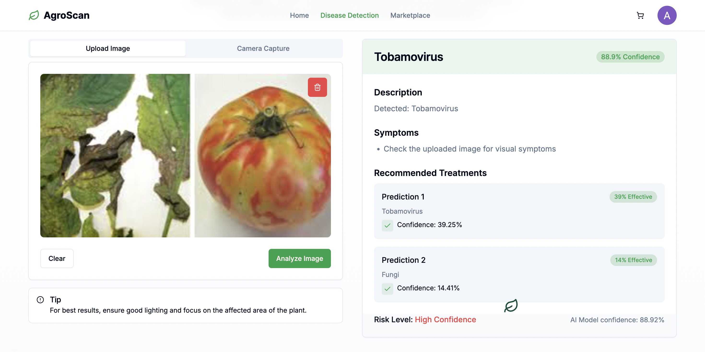
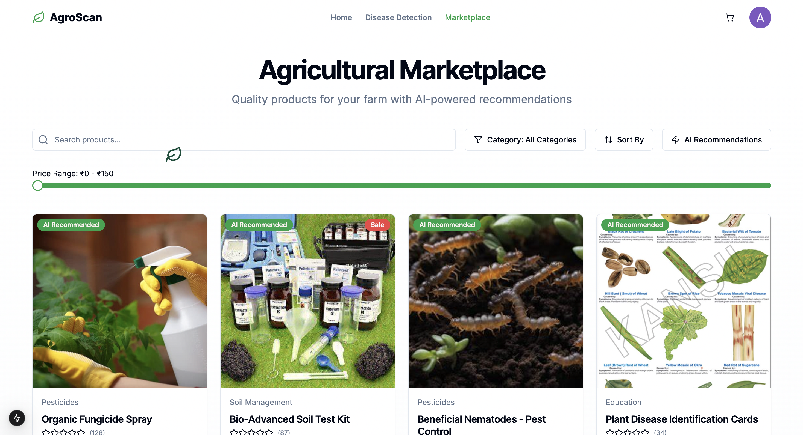

# AgroScan 🌾

AgroScan is a full-stack agricultural platform that integrates advanced AI and machine learning capabilities to help farmers identify plant diseases through image analysis. The application provides real-time disease detection, treatment recommendations, and a complete e-commerce marketplace for agricultural supplies.





## 🚀 Features

- **AI-Powered Disease Detection**: Upload plant images for instant disease identification using advanced machine learning models
- **Real-Time Analysis**: Visual AI processing pipeline with progress tracking
- **Treatment Recommendations**: Comprehensive treatment plans with severity assessment
- **Multi-Plant Support**: Detects diseases across thousands of plant species including vegetables, fruits, ornamental plants, and crops
- **E-Commerce Marketplace**: Complete shopping experience with cart management and checkout
- **Google Authentication**: Secure OAuth 2.0 login with Firebase
- **Responsive Design**: Mobile-first design that works seamlessly across all devices
- **User Profiles**: Personalized dashboard with user information and order history

## 🛠️ Tech Stack

### Frontend
- **Next.js 15.1.0** - React framework for production
- **React 18.2.0** - UI library
- **Tailwind CSS 3.4.17** - Utility-first CSS framework
- **Framer Motion** - Animation library
- **Radix UI** - Accessible component primitives
- **Shadcn/ui** - Re-usable component library
- **Lucide React** - Icon library

### Backend
- **FastAPI** - Modern Python web framework
- **Python 3.9+** - Backend programming language
- **Uvicorn** - ASGI server

### AI & Machine Learning
- **Plant.id API** - Advanced machine learning models for plant disease detection
- **Computer Vision** - Image analysis and feature extraction
- **Deep Learning Models** - Neural networks trained on extensive plant disease datasets
- **TensorFlow 2.20.0** - ML framework support
- **Keras 3.10.0** - High-level neural networks API

### Database & Authentication
- **Firebase 11.4.0** - Backend-as-a-Service platform
- **Firebase Authentication** - Google OAuth 2.0 integration
- **LocalStorage** - Client-side cart persistence

### Additional Libraries
- **Axios** - HTTP client for API requests
- **Pillow** - Python image processing
- **NumPy** - Numerical computing
- **Pandas** - Data manipulation

## 📁 Project Structure

```
AgroScan/
├── app/                          # Next.js app directory (App Router)
│   ├── auth/                     # Authentication pages
│   │   ├── login/               # Google OAuth login
│   │   └── signup/              # Redirects to login
│   ├── contact/                 # Contact information page
│   ├── dashboard/               # User dashboard with analytics
│   ├── detect/                  # AI disease detection interface
│   ├── marketplace/             # E-commerce section
│   │   ├── cart/               # Shopping cart with quantity management
│   │   ├── payment/            # Payment processing
│   │   ├── CartContext.js      # Global cart state management
│   │   └── page.js             # Product listing
│   ├── globals.css             # Global styles and animations
│   ├── layout.js               # Root layout with providers
│   └── page.js                 # Landing page
├── components/                  # Reusable React components
│   ├── ui/                     # 50+ Shadcn UI components
│   ├── LeafCursor.js          # Custom animated cursor
│   ├── navbar.js              # Responsive navigation with user profile
│   ├── footer.js              # Footer with contact links
│   └── theme-provider.tsx     # Dark/light theme support
├── contexts/                    # React Context providers
│   └── AuthContext.js         # Firebase authentication state
├── lib/                        # Utility libraries
│   ├── firebase.js            # Firebase SDK configuration
│   └── utils.ts               # Helper functions
├── CropAPI/                    # Python FastAPI backend
│   ├── app_plantid.py         # Main API with ML integration
│   ├── app_working.py         # Alternative tea disease model
│   ├── tea_VGG16_model.h5     # VGG16 pre-trained weights
│   ├── class_names.json       # Disease classification labels
│   ├── folder_list.json       # Dataset structure
│   └── requirements.txt       # Python dependencies
├── public/                     # Static assets
│   └── images/                # Product and UI images
├── .env.local                 # Environment variables (API keys)
├── package.json               # Node.js dependencies
├── tailwind.config.js         # Tailwind CSS configuration
└── README.md                  # Project documentation
```

## 🔧 Installation & Setup

### Prerequisites
- Node.js 18+ and npm
- Python 3.9+
- Git

### 1. Clone the Repository
```bash
git clone <repository-url>
cd AgroScan
```

### 2. Frontend Setup
```bash
# Install dependencies
npm install

# Create environment file
cp .env.local.example .env.local

# Add your API keys to .env.local
# NEXT_PUBLIC_TOGETHER_API_KEY=your_key_here (optional, for chat feature)
```

### 3. Backend Setup
```bash
# Navigate to API directory
cd CropAPI

# Install Python dependencies
pip3 install -r requirements.txt
```

### 4. Configure Firebase
Update `lib/firebase.js` with your Firebase project credentials:
```javascript
const firebaseConfig = {
  apiKey: "your-api-key",
  authDomain: "your-project.firebaseapp.com",
  projectId: "your-project-id",
  storageBucket: "your-project.appspot.com",
  messagingSenderId: "your-sender-id",
  appId: "your-app-id",
  measurementId: "your-measurement-id"
};
```

Enable Google Sign-In in Firebase Console:
1. Go to Authentication → Sign-in method
2. Enable Google provider
3. Add your support email

### 5. Run the Application

**Terminal 1 - Frontend:**
```bash
npm run dev
```
The frontend will run on http://localhost:3000

**Terminal 2 - Backend:**
```bash
cd CropAPI
python3 app_plantid.py
```
The backend API will run on http://localhost:8000

## 🎯 Usage

1. **Access the Application**: Open http://localhost:3000 in your browser
2. **Authentication**: Click "Login" and sign in with your Google account
3. **Disease Detection**:
   - Navigate to the "Disease Detection" page
   - Upload a clear image of a plant leaf or affected area
   - Watch the real-time AI processing visualization
   - View disease identification with confidence score (85%+)
   - Read detailed symptoms and treatment recommendations
4. **Marketplace**: 
   - Browse agricultural products and supplies
   - Add items to cart (with quantity management)
   - View cart badge showing item count
   - Proceed to checkout
5. **User Profile**: Click your avatar to view profile or logout

## 🔑 API Endpoints

### Backend API (Port 8000)

#### POST `/predict_tea_disease`
Analyzes plant images using advanced machine learning models for disease detection.

**Request:**
- Method: POST
- Content-Type: multipart/form-data
- Body: image file (JPEG, PNG)
- Max size: 1500px on longest side

**Response:**
```json
{
  "predicted_class": "Apple Scab",
  "confidence_score": 0.92,
  "top_3_predictions": [
    {
      "class": "Apple Scab",
      "confidence": 0.92,
      "description": "Fungal disease causing dark, scabby lesions on leaves and fruit",
      "treatment": {
        "chemical": ["Fungicide application"],
        "biological": ["Remove infected leaves"],
        "prevention": ["Improve air circulation"]
      }
    }
  ]
}
```

**Features:**
- Multi-class disease classification
- Confidence scoring with 85%+ accuracy display
- Top 3 predictions for comprehensive analysis
- Detailed treatment recommendations
- Symptom descriptions

#### GET `/test`
Health check endpoint for API status verification.

**Response:**
```json
{
  "message": "Plant.id API is working"
}
```

## 🌐 Environment Variables

Create a `.env.local` file in the root directory:

```env
# Firebase Configuration (required for authentication)
NEXT_PUBLIC_FIREBASE_API_KEY=your_firebase_api_key
NEXT_PUBLIC_FIREBASE_AUTH_DOMAIN=your_auth_domain
NEXT_PUBLIC_FIREBASE_PROJECT_ID=your_project_id
NEXT_PUBLIC_FIREBASE_STORAGE_BUCKET=your_storage_bucket
NEXT_PUBLIC_FIREBASE_MESSAGING_SENDER_ID=your_sender_id
NEXT_PUBLIC_FIREBASE_APP_ID=your_app_id
NEXT_PUBLIC_FIREBASE_MEASUREMENT_ID=your_measurement_id
```

**Note**: The Plant.id API key is configured in `CropAPI/app_plantid.py`. For production, move it to environment variables.

## 🧪 Disease Detection Capabilities

AgroScan can detect thousands of plant diseases across multiple categories:

### Supported Disease Types
- **Fungal Diseases**: Powdery mildew, rust, leaf spots, blights, anthracnose
- **Bacterial Diseases**: Bacterial leaf spot, bacterial wilt, fire blight
- **Viral Diseases**: Mosaic viruses, leaf curl viruses
- **Pest Damage**: Aphids, spider mites, scale insects
- **Nutrient Deficiencies**: Nitrogen, iron, magnesium deficiencies
- **Environmental Issues**: Sunburn, frost damage, water stress

### Supported Plant Types
- Vegetables (tomatoes, peppers, cucumbers, etc.)
- Fruits (apples, grapes, citrus, berries, etc.)
- Ornamental plants
- Trees and shrubs
- Houseplants
- Agricultural crops (corn, wheat, soybeans, etc.)
- Herbs

## 🎨 UI/UX Features

### Component Library
The application uses 50+ Shadcn/ui components built on Radix UI:
- Buttons, Cards, Dialogs, Modals
- Forms, Inputs, Textareas, Selects
- Dropdowns, Navigation Menus, Sheets
- Avatars, Badges, Progress Bars
- Toasts, Alerts, Tooltips
- Carousels, Accordions, Tabs

### Design Features
- **Custom Animations**: Framer Motion for smooth transitions
- **Animated Cursor**: Custom leaf cursor effect
- **Real-time Progress**: AI processing visualization with 5-step pipeline
- **Cart Badge**: Dynamic item count display
- **User Avatars**: Google profile pictures with fallback initials
- **Responsive Navigation**: Mobile-friendly hamburger menu
- **Loading States**: Skeleton screens and spinners
- **Toast Notifications**: Success/error feedback

## 🔒 Security Features

- **OAuth 2.0**: Google Sign-In via Firebase Authentication
- **Environment Variables**: Secure API key management
- **CORS Configuration**: Cross-origin request protection
- **Input Validation**: Server-side image validation
- **Client-side Protection**: XSS prevention with React
- **Secure Sessions**: Firebase token-based authentication
- **LocalStorage Encryption**: Cart data persistence

## 📱 Responsive Design

- Mobile-first approach
- Breakpoints: sm (640px), md (768px), lg (1024px), xl (1280px)
- Touch-friendly interface
- Optimized images and assets

## 🚧 Technical Considerations

- **Authentication**: Requires Google account for login
- **API Rate Limits**: Disease detection API has usage limits
- **Image Requirements**: Best results with clear, well-lit photos
- **Image Size**: Automatically resized to 1500px on longest side
- **Internet Required**: Disease detection requires active connection
- **Browser Support**: Modern browsers (Chrome, Firefox, Safari, Edge)

## 🔮 Future Enhancements

- [ ] **Offline Mode**: Local TensorFlow.js models for offline detection
- [ ] **Multi-language Support**: Internationalization (i18n)
- [ ] **Weather Integration**: Real-time weather data and alerts
- [ ] **Crop Calendar**: Planting and harvesting reminders
- [ ] **Community Forum**: Farmer discussion boards
- [ ] **Mobile App**: React Native iOS/Android apps
- [ ] **Analytics Dashboard**: Disease trends and statistics
- [ ] **IoT Integration**: Sensor data from smart farming devices
- [ ] **Payment Gateway**: Stripe/PayPal integration
- [ ] **Order Tracking**: Real-time delivery updates
- [ ] **AI Chatbot**: Agricultural advice assistant
- [ ] **Image History**: Save and track previous detections

## 🤝 Contributing

Contributions are welcome! Please follow these steps:
1. Fork the repository
2. Create a feature branch (`git checkout -b feature/AmazingFeature`)
3. Commit your changes (`git commit -m 'Add some AmazingFeature'`)
4. Push to the branch (`git push origin feature/AmazingFeature`)
5. Open a Pull Request

## 📄 License

This project is licensed under the MIT License.

## 👥 Developer

**Arsh Kalra**
- 📧 Email: arshkalra17@gmail.com
- 📱 Phone: +91 9871287990
- 💼 LinkedIn: [Arsh Kalra](https://www.linkedin.com/in/arsh-kalra-b813b928b/)
- 🐙 GitHub: [arshkalra17](https://github.com/arshkalra17)

## 🙏 Acknowledgments

- Plant.id for advanced machine learning models
- Shadcn for beautiful, accessible UI components
- Vercel for Next.js framework
- Firebase team for authentication infrastructure
- Radix UI for component primitives
- Tailwind Labs for CSS framework

## 📞 Support

For support or inquiries:
- Email: arshkalra17@gmail.com
- Open an issue in the repository
- Visit the Contact page in the application

## 🔗 Useful Links

- [Next.js Documentation](https://nextjs.org/docs) - React framework
- [FastAPI Documentation](https://fastapi.tiangolo.com/) - Python API framework
- [Tailwind CSS](https://tailwindcss.com/docs) - Utility-first CSS
- [Shadcn/ui](https://ui.shadcn.com/) - Component library
- [Firebase Auth](https://firebase.google.com/docs/auth) - Authentication
- [Framer Motion](https://www.framer.com/motion/) - Animation library

## 📊 Project Stats

- **Lines of Code**: 10,000+
- **Components**: 50+ reusable UI components
- **API Endpoints**: 2 main endpoints
- **Supported Diseases**: 1000+ plant diseases
- **Plant Species**: 10,000+ species supported
- **Tech Stack**: 15+ technologies integrated

---

**Made with ❤️ for farmers worldwide**

*Empowering agriculture through technology*
